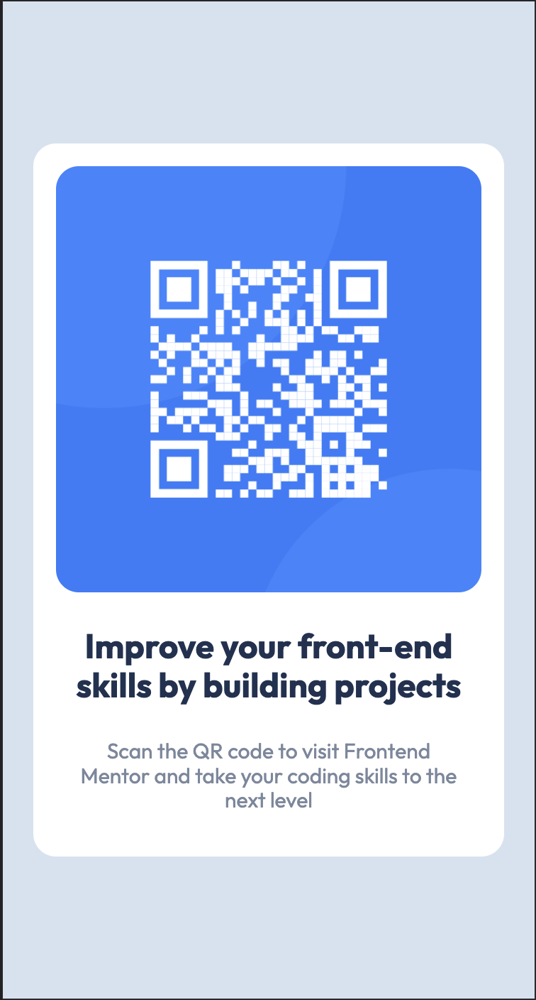
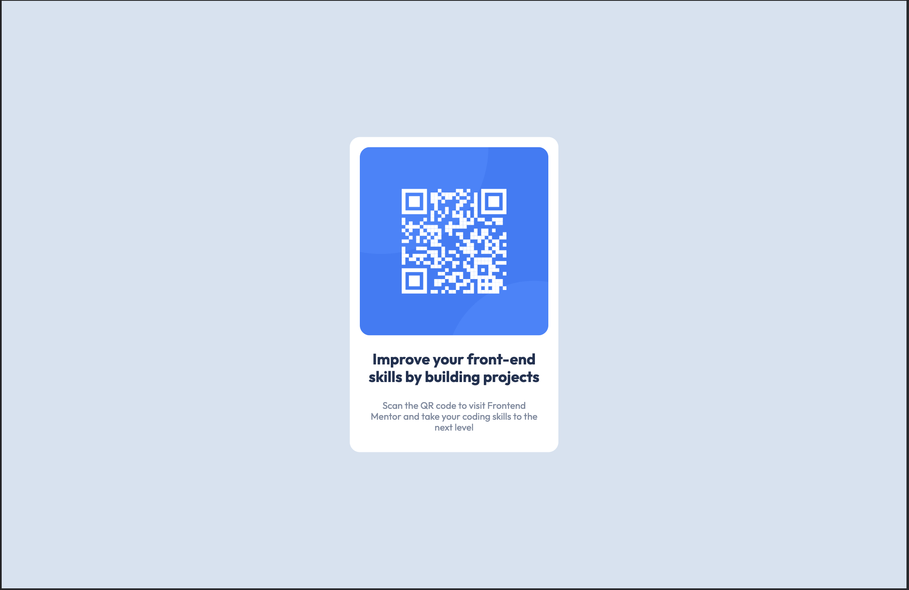

# Frontend Mentor - QR code component solution

This is a solution to the [QR code component challenge on Frontend Mentor](https://www.frontendmentor.io/challenges/qr-code-component-iux_sIO_H). Frontend Mentor challenges help you improve your coding skills by building realistic projects.

## Table of contents

- [Overview](#overview)
  - [Screenshot](#screenshot)
  - [Links](#links)
- [My process](#my-process)
  - [Built with](#built-with)
  - [What I learned](#what-i-learned)
  - [Continued development](#continued-development)
- [Author](#author)

## Overview

### Screenshot

### Links

- Solution URL: [Github page](https://arag.github.io/frontendMentor-qrCodeComponent/)

## My process

### Built with

- Semantic HTML5 markup
- CSS custom properties
- Flexbox
- Mobile-first workflow

### What I learned

My main objective with the frontend mentor challenges is to improve my layout skills, focusing on each solution being responsive.

I added a css file to normalize the styles that each browser applies. I would like to know if this is a good practice or what suggestions can you make me regarding this point.

It's the first time I used variables in css. I don't know if it's convenient to use scss, sass or some other css preprocessor.

### Continued development

I would like to continue learning how to use relative measures and when, how and why to use fixed measures.
For example, in order for the card not to grow relative to the dimensions of the device, I had to set a maximum width and a maximum height in pixels. This fixed it to keep growing as the resolution changed, but it wasn't entirely clear to me.

## Author

A bit about myself:
Nowadays I work as software developer and I love my job. I want to continue learning and now I know that this is only possible with practice. As I mentioned before, my main goal is to improve my layout skills, actually my frontend skills. I wish frontend mentor helps me to get my goal.

- Frontend Mentor - [Ara](https://www.frontendmentor.io/profile/arag)
